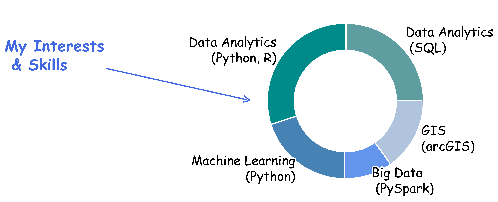

<html>
<head>

</head>
<body>

<h1 class="main"> Portfolio: Ricardo Ibarra Gil </h1>

<h2> About me </h2>

I am a trained Economist with a strong background in <b>statistics</b>, and a passion for uncovering insights from data. My previous professional experience includes extensive consulting work on energy related policies. 

During the last few years I have pivoted into <b>data analytics</b>, with special interest in <b>public policy</b>, <b>consumer behavior</b>, <b>health policy</b>,  <b>natural language processing and social media analysis</b>, <b>machine learning for problem solving</b>, and <b>geospatial analysis</b>. 

I am currently a Master's student at Carnegie Mellon University, where I have refined and expanded my programming and analytical skill set. 

At Carnegie Mellon, I have collaborated as a Teaching Assistant for <b>Intermediate Python</b>, <b>Geographic Inforamtion Systems (GIS)</b>, and tutored for <b>Introduction to Programming with Python</b>
 

<!-- My main interests are:
Machine learning ..

To solve complex problems.
To get insights that would go unnoticed  

The use of data to better understand consumer behavior  

Social listening to enhance consumer experience

Geographic data analytics...
Data Science

Data analytics
SQL
Python
Pyspark   

Teaching Assistant for <b>Intermediate Python, Geographic Information Systems (GIS)</b> 
Tutoring for <b>Introduction to Python </b>  -->

<!--  -->
 
 
 

<!-- # METER UNA GRAFICA DE INTERESES
25% GIS
40% Data analytics
25% Machine learning
10% Otra cosa?
Economic analysis
Consumer behavior

Skills
SQL
Python
R
GIS
Stata -->

<!--  -->

 
 
 
 
<!-- Etcetera 
Etcetera 
Etcetera  -->

<h1 class="main"> Projects </h1>

<h2> Machine Learning  </h2>
<!-- <b> Sentiment analysis using NLP and logistic regression</b> 
August, 2022 - December, 2022 
Examined tweets about different brands of glucose-monitoring devices to find the most relevant features for positive and negative sentiments, uncover users’ knowledge gaps, and recommend the brands what actions would improve users’ perceptions 
  -->
<b>Detection of Monkeypox and simulation of early detection policies using a Convolutional Neural Network and epidemiological models --> <a href="https://github.com/ribarragi/past_projects/blob/72246a17a20fb6acceea934dabe03c2acc1354e2/SIR_NN_Project%20Report.pdf"> Report </a> --> <a href="https://github.com/mahrukh-k/DABP.git">Code</a></b> 
August, 2022 - December, 2022 
Developed an app to identify monkeypox from skin lesions imagery, as well as an epidemiological model to simulate the app’s impact on the spread of monkeypox in U.S. population 
 
<b>Profiling credit card clients for a bank using dimensionality reduction and clustering--> <a href="https://ribarragi.github.io/past_projects/Profiling_CC_brief.html#/"> Report with code</a></b> 
January, 2022 - April, 2022 
Analyzed customers' usage of credit cards using Principal Component Analysis and different clustering methods to generate clients' profiles and recommend tailored strategies and products. 
 
<b>Sentiment analysis of social media posts relate to train derailment in East Palestine Ohio: were government, media and people in the same channel? --> <a href="https://github.com/mahrukh-k/AI-Project"> In progress </a></b> 
January, 2023 - ... 
<!-- Developed an app to identify monkeypox from skin lesions imagery, as well as an epidemiological model to simulate the app’s impact on the spread of monkeypox in U.S. population  -->
 
<b>Social listening for Honda --> <a href="https://ribarragi.github.io/"> In progress </a></b> 
January, 2023 - ... 
Conducted customer sentiment analysis to inform messaging strategy for the promotion of Honda's electric vehicles, leveraging Brandwatch to gather social media data, as well as scraping data from online forums for analysis. 
 

<h2> GIS  </h2>  
<b>Access to health services in Mexico City. The role of Medical Offices in Pharmacies (MOPs) --><a href="https://storymaps.arcgis.com/stories/8381685eb7764b63b4a5b98e356b405a"> Story map</a></b>   
January, 2022 - May, 2022 
This geo spatial analysis shows that the main logic behind the expansion of MOPs in Mexico City has not been -as often publicized- trying to reach unserved population, but rather capturing a market previously served by other options of healthcare, rather than expanding towards underserved areas.
Additionally, state level data provides little evidence about the behavior of MOP doctors towards prescription drugs. But it provides somewhat stronger evidence about some of the factors that drive peoples decision to use their services (lower waiting time, and lower travel times) 
 
<b> Map tornadoes... in the U.S. with clustering analysis --> <a href="https://github.com/ribarragi/past_projects/blob/c0d279834473e786864dfe8da9f4c29dca2363de/GIS_tornadoes.pdf">Map</a></b> 
March, 2022  
Analyze historical data of tornadoes in the U.S. from 2000 throu 2008: perform k-means clustering on several measures of impact to identify areas with the most fatalities, injuries, and damages, and determine whether they fall inside or outside of "Tornado Alley", a location of central U.S. where tornadoes are most frequent.  
 
<b> Walkability in two neighborhoods in Pittsburgh --> <a href="https://github.com/ribarragi/past_projects/blob/6d06bca2a7c54222cbb31e4e3618b4eabe2aacda/GIS_assesswalkability.pdf">Map</a></b> 
February, 2022  
Assess walkability of two neighborhoods in Pittburgh, PA, based on different criteria such as density, availability of parks and playgrounds, terrain elevation, and street patterns.  
 
<b>Distribution mapping for Electric Vehicle Charging within urban communities</b>   
<b>In progress...</b> 
Locate the best sites for Electric Vehicle public charging stations, considering current and potential demand, equitable access, physical feasibility, sociodemographic factors, and walking distance restrictions in urban communities of the state of Pennsylvania, mainly using R, Python and ArcGIS. 
 
 
<h2> R  and R Shiny  </h2>
<b> Analysis of car crashes in Allegheny county --> <a href="https://ribarragi.github.io/past_projects/Carcrashes_Allegheny.html"> Report</a> --> <a href="https://ribarragi.github.io/past_projects/Carcrashes_Allegheny.html"> Code </a></b> 
Date, 2021 - Date, 2021  
Brief description 
 
<b>Crimes in  Chicago, 2022 --> <a href="https://wxctrb-ricardo-ibarra0gil.shinyapps.io/hw1-ribarrag/">Dashboard</a> -->
<a href="https://ribarragi.github.io/past_projects/Carcrashes_Allegheny.html">Code</a></b> 
Date, 2021 - Date, 2021  
Dashboard showing crimes committed in Chicago during 2022. The dashboard contains: 1) a bar chart with the number of crimes per month; 2) a tree map with the type of crimes; 3) a heat map witht he crimes by time and day of the week; and 4) a table with the raw data. All 4 elements are reactive to the filters: Location of crime, include/exclude domestic violence crimes. Selected data can be downloaded as a csv file.  
 
<b> U.S. airports (1990 - 2022) --> <a href="https://wxctrb-ricardo-ibarra0gil.shinyapps.io/final_app/?_ga=2.56959658.1004282767.1679676223-1603397868.1679676223">Dashboard</a> --> <a href="https://ribarragi.github.io/past_projects/Carcrashes_Allegheny.html">Code</a></b> 
Date, 2021 - Date, 2021  
Dashboard displaying 1) location of U.S. airports on a map; 2) stacked bar chart with total flyers in selected airports by year and by carrier origin; 3) top 5 carriers operating in selected airports with total no. of passengers. All elements are reactive to the filters that enable the user to select: the airport(s) to be shown in map and data dsiplayed, the years for which the data will be displayed; 3) the state(s). Selected data can be downloaded as a csv file.  
 
<b> Shopping store data --> <a href="https://wxctrb-ricardo-ibarra0gil.shinyapps.io/final_app/?_ga=2.56959658.1004282767.1679676223-1603397868.1679676223">Dashboard</a> -->
<a href="https://ribarragi.github.io/past_projects/Carcrashes_Allegheny.html">Code</a></b> 
Date, 2021 - Date, 2021  
Dashboard contains three bins: 1) products sold and customers, shows information about cusomter's income, amount spent per type of grocery and composition of sales; 2) sales channel, displays data about sales channel (online, in store, catalog) over time; 3) data table, shows all selected data as a raw table, which can be downloaded in .csv format. All 3 tabs contain graphs and tables reactive to filters that enable the user select: customers' age range, customers' education level; number of children in customers' households.  
 
<h2> Other projects  </h2>
<!-- <b>Application to assist people relocating in the U.S. using Python</b> 
August, 2021 - December, 2021 
It presents key indicators of living conditions at the county level in the user's area of interest, along with interactive maps. Data sources include API, web scraping, and CSV. 
 
<b>EDA analysis on .... RESERVATINOS AND CANCELATIONS: preguntas 1 y 2</b> 
Augist, 2021 - December, 2021 
 
  -->

<!-- <b>Honda project</b>
In progress
Included scraping >1 million entries fro Honda forums and analyse them to get a better sense of customers' brand perception -->

<b>Interactive covid vaccination maps in the U.S. (plotly) --> <a href="https://ribarragi.github.io/past_projects/US_BoosterMap_county.html">Continental U.S.</a> --> <a href="https://ribarragi.github.io/past_projects/BoosterMap_county_FL.html">Florida</a> --> <a href="https://ribarragi.github.io/past_projects/BoosterMap_county_GA.html">Georgia</a> --> <a href="https://ribarragi.github.io/past_projects/BoosterMap_county_PA.html ">Pennsylvania</a></b> 
August, 2021 - December, 2021 
 
 

<!-- <h1 class="main">Previous work experience<h1>
<h2> Carvana </h2>
Product Analytics Intern
something  

<h2> StructurA </h2>
something  
something
 -->

<h1 class="main"> Education </h1>

 <b>Carnegie Mellon University</b> 
MSc in Public Policy and Data Analytics 
 
 
 <b>ITAM</b> 
BA in Economics 

<!-- 
# Telling stories with data
# GIS final project -->

<!--  -->

<!-- 
Link here: https://ribarragi.github.io/ -->

